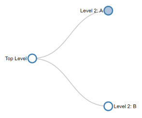

# mindex
A [Mind-map](https://en.wikipedia.org/wiki/Mind_map) generator for JSON / XML / CSV or HTML-tables (saved from Excel)

[](https://bl.ocks.org/d3noob/1a96af738c89b88723eb63456beb6510 "Credit")

---

> **USAGE**: 

> **`dotnet tool install -g mindex --no-cache`**

> **`mindex`** `path-to-json-or-csv-or-xml-or-html-file` [`header-rows-count-in-case-of-html`]

---

> **JSON** (hierarchical-tree-support)

```json
{
  "name": "root",
  "parent": null,
  "children": [
    {
      "name": "child-1",
      "parent": "root",
      "children": [
        {
          "name": "sub-child-1",
          "parent": "child-1",
          "children": [
            {
              "name": "leaf-node",
              "parent": "sub-child-1",
              "url": "https://www.google.com",
            },
            ...
          ]
        },
        ...
      ]
    },
    ...
  ]
}
```

> **XML** (hierarchical-tree-support)

```xml
<root xmlns:json="http://james.newtonking.com/projects/json">
    <name>root</name>
    <parent />
    <children json:Array="true">
        <name>child-1</name>
        <parent>root</parent>
        <children json:Array="true">
            <name>sub-child-1</name>
            <parent>child-1</parent>
            <children json:Array="true">
                <name>leaf-node</name>
                <parent>sub-child-1</parent>
                <url>https://www.google.com</url>
            </children>
            ...
        </children>
        ...
    </children>
</root>
```

> **CSV** (flat-hierarchical / single-header)

```csv
header-1,header-2,header-3
child-1.1,child-2.1,child-3.1
child-1.2,child-2.2,child-3.2
...
```

---

> **HTML** (hierarchical-tree-support using multiple `tr` / `td` with col-span) - Pass the headers-count as the last argument
```html
<table>
    <tr>
        <td>
            ...
        </td>
        ...
    </tr>
    ...
</table>
```
---

```batch
# Install from local project path
dotnet tool install -g --add-source ./bin mindex
```

---

> **TODOs** 
> - Handle `th` / `tbody` in case of HTML tables
> - Accept *custom-styles*
> - Handle `overflow-x` on mobile-screens
> - Drag nodes
> - Use [linkHorizontal](https://observablehq.com/@d3/tidy-tree)